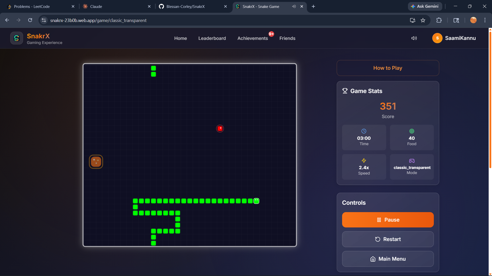
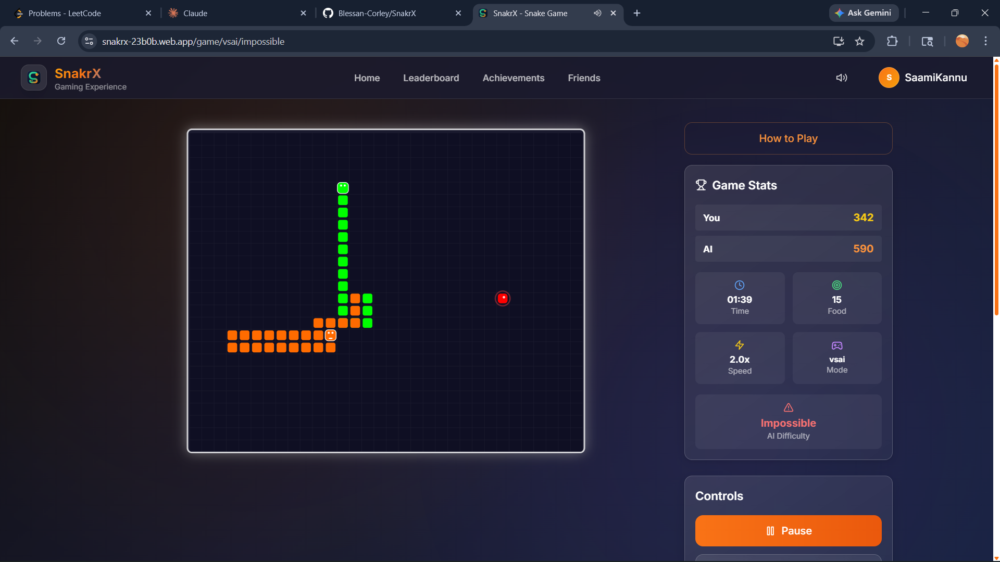

# SnakrX

[](https://github.com/Blessan-Corley/SnakrX/actions/workflows/ci.yml)
[](https://snakrx-23b0b.web.app/landing)

A browser-based snake game built as a full product — with authentication, user profiles, leaderboards, achievements, friends, support, and an admin panel.

**[Play it here](https://snakrx-23b0b.web.app/landing)**

---


---

## Game Modes

| Mode | Description |
|------|-------------|
| Classic | Standard snake gameplay with progression and speed scaling |
| Transparent | Walls are passable — snake wraps around the board |
| VS AI | Play against an AI opponent with Easy, Hard, or Impossible difficulty |
| Local Multiplayer | Two players on the same keyboard |

---

## Screenshots

<table>
  <tr>
    <td></td>
    <td></td>
  </tr>
  <tr>
    <td align="center">Transparent Mode</td>
    <td align="center">VS AI — Impossible Difficulty</td>
  </tr>
</table>

---

## Product Features

- Email/password authentication with OTP email verification
- User profiles with avatar upload
- Public profile pages
- Match history
- Achievement system with unlock tracking
- Global and weekly leaderboards per game mode
- Friends and social profile surfaces
- Support ticket submission with email notifications
- Admin panel for support management and moderation
- PWA support — installable with offline-cached assets

---

## Tech Stack

### Frontend

| Tool | Purpose |
|------|---------|
| React 18 | UI framework |
| Vite 5 | Build tool and dev server |
| React Router 6 | Client-side routing |
| Tailwind CSS 3 | Styling |
| Framer Motion | Animations and transitions |

### Backend and Infrastructure

| Service | Purpose |
|---------|---------|
| Firebase Authentication | Identity and session management |
| Cloud Firestore | Primary database |
| Firebase Cloud Functions | Backend logic (Node 20) |
| Firebase Storage | Avatar file storage |
| Firebase Hosting | Static hosting and CDN |

### Testing and Quality

| Tool | Purpose |
|------|---------|
| Vitest | Unit and integration tests |
| Testing Library | Component and hook testing |
| Playwright | End-to-end browser tests |
| ESLint + Prettier | Code style enforcement |
| GitHub Actions | CI pipeline |

---

## Architecture

The browser handles the game loop, rendering, and local session state. Firebase manages identity, persistence, and file storage. Backend logic runs as Cloud Functions.

### Frontend

- `src/pages` — Route-level pages (auth, game, leaderboard, profile, admin, achievements)
- `src/components` — Reusable UI and feature components
- `src/hooks` — Feature logic, game orchestration, and state management
- `src/services/firebase` — Firebase SDK access and service wrappers
- `src/utils` — Game mechanics, AI logic, sound, and shared utilities

### Cloud Functions

| Module | Responsibility |
|--------|---------------|
| `otp.js` | Email OTP delivery and verification |
| `games.js` | Game session finalization and stat updates |
| `leaderboards.js` | Leaderboard upserts and weekly aggregation |
| `achievements.js` | Achievement unlock logic |
| `support.js` | Ticket creation, admin updates, email notifications |
| `avatar.js` | Avatar upload and deletion |
| `admin.js` | Ban/unban and admin operations |
| `friends.js` | Friend request and edge management |
| `registration.js` | User registration workflow |
| `passwordReset.js` | Password reset email and verification |

### Data Model

Firestore collections:

- `users` — Account data, stats, and settings
- `publicProfiles` — Public-facing user information
- `games` — Per-session game records (server-written)
- `leaderboards` — Per-mode global rankings
- `weeklyLeaderboards` — Weekly snapshots (scheduled job)
- `achievements` — Per-user unlock records
- `supportTickets` — Support requests and admin responses
- `emailOtps` — Short-lived OTP codes (server-written, client-read blocked)

Security rules in `firestore.rules` and `storage.rules` restrict client writes on server-owned data and enforce field-level access control.

---

## Local Setup

### Prerequisites

- Node.js 20
- npm
- A Firebase project with web app credentials

### Install

```bash
npm install
npm ci --prefix functions
```

### Environment

```bash
cp .env.example .env
# Fill in the VITE_FIREBASE_* values
```

For local email flows (OTP, support):

```bash
cp functions/.env.example functions/.env
# Fill in EMAIL_USER, EMAIL_PASS, OTP_SALT, etc.
```

### Run

```bash
npm run dev
# http://localhost:3000
```

---

## Commands

```bash
# Development
npm run dev
npm run build
npm run preview

# Code quality
npm run lint
npm run format

# Tests
npm run test:run          # Unit and integration tests
npm run test:coverage     # With coverage thresholds
npm run e2e:public        # Playwright — public flows
npm run e2e:auth          # Playwright — authenticated flows

# CI quality gate
npm run ci:quality

# Deployment
npm run check:deploy-env
npm run deploy:hosting
npm run deploy:firebase
```

---

## CI Pipeline

GitHub Actions runs on every push and pull request:

1. **Lint** — ESLint with zero warnings allowed
2. **Unit tests** — Vitest with coverage thresholds (63% branches, 53% functions, 44% lines)
3. **Build verification** — Production Vite build
4. **E2E (public)** — Playwright against public pages and navigation
5. **E2E (auth)** — Playwright against authenticated flows (runs when credentials are available)
6. **CD artifact** — Production dist uploaded on main branch after all checks pass

---

## Deployment

```bash
firebase deploy --project <your-project-id> --only firestore:rules,firestore:indexes,storage,functions,hosting
```

Notes:
- Deploy Cloud Functions before expecting OTP, leaderboard, support, or game session persistence to work
- Cloud Functions in production read from deployed environment config, not your local `functions/.env`

---

## Repository Structure

```
src/
  pages/          Route-level pages
  components/     Reusable UI and feature components
  hooks/          State and feature logic
  services/       Firebase SDK wrappers
  utils/          Game mechanics and shared utilities
functions/
  src/            Cloud Function modules
e2e/              Playwright test suites
docs/             Architecture and deployment notes
```

---

## Docs

- [Architecture](docs/architecture.md)
- [Deployment Readiness](docs/deployment-readiness.md)
- [Production Deployment](docs/production-deployment.md)

